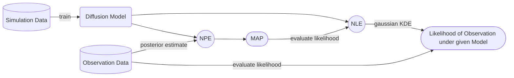
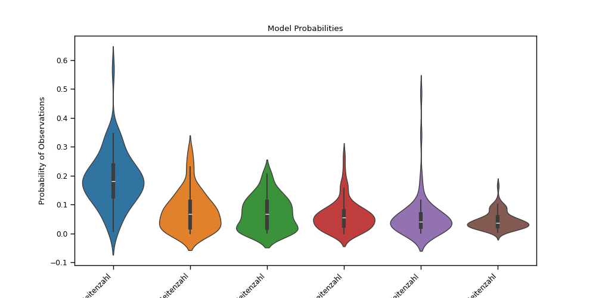
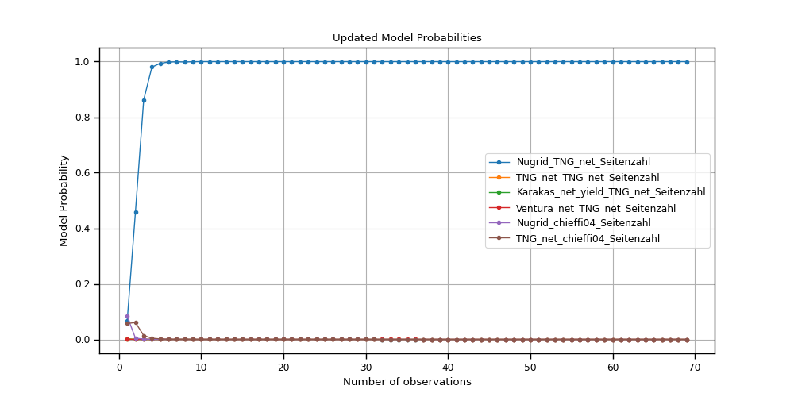

# Simulation-Based Bayesian Model Comparison

This repo explores a novel approach to Simulation-Based Inference (SBI) and Bayesian Model Comparisan by leveraging a [**score-based diffusion model**](https://arxiv.org/abs/2011.13456) combined with a [**transformer architecture**](https://arxiv.org/abs/1706.03762) [[Peebles et al.](https://arxiv.org/abs/2212.09748), [Gloecker et al.](https://arxiv.org/abs/2404.09636)].  
The model utilizes an **attention mask** to conditionally predict both the **posterior distribution** and the **likelihood** of the data.  
By calculating the **log-likelihood** of the **MAP-parameters** for observations, we can compare the fit of different simulators to the data.  

This framework is applied to compare different yield sets in a simulator for stellar abundances from galactic and stellar parameters ([**CHEMPY**](https://arxiv.org/pdf/1909.00812)), providing a robust and scalable method for likelihood-free inference in high-dimensional parameter spaces.

### Workflow

---
---
## Diffusion Model

### Perturbing Data in a Diffusion Process
For the training of the diffusion model we have to first turn our data into noise and then train the transformer to denoise it step by step for every timestep.  
The diffusion process is defined by the following equation:

$$
d\mathbf{x} = \mathbf{f}(\mathbf{x},t) dt + g(t) d\mathbf{w}
$$

where $\mathbf{f}(\cdot, t): \mathbb{R}^d \to \mathbb{R}^d$ is called the *drift coefficient* of the stochastic differential equation (SDE), $g(t) \in \mathbb{R}$ is called the *diffusion coefficient*, and $\mathbf{w}$ represents the standard Brownian motion.  
We use a Variance Exploding SDE (VESDE) for the diffusion process, where the *drift* and *diffusion coefficients* are defined as followed:

$$
\mathbf{f}(\mathbf{x}, t) = \mathbf{0} \quad \text{and} \quad g(t) = \sigma^t
$$

where $\sigma$ is a hyperparameter that controls the scale of the diffusion process.  
Following the theory of SDEs, we can formulate the perturbed data distribution at timestep $t$ as:

$$
    p_{0t}(\mathbf{x}_t|\mathbf{x}_0) = \mathcal{N} \bigg( \mathbf{x}_t | \mathbf{x}_0, \frac{1}{2 \ln \sigma}(\sigma^{2t}-1)\mathbf{I} \bigg)
$$

So the variance function over time of the perturbed data distribution is given by:

$$
    \sigma_t^2 = \frac{1}{2 \ln \sigma}(\sigma^{2t}-1)
$$

Step-by-step diffusion process with Variance Exploding SDE (VESDE):  

Galactic Parameters           |  Chemical Abundances
:-------------------------:|:-------------------------:
  |  

### Reversing the Diffusion Process
Reversing the diffusion process is running the diffusion process backwards in time. 

$$
d\mathbf{x} = \big[\mathbf{f}(\mathbf{x}, t) - g^2(t)\nabla_{\mathbf{x}}\log p_t(\mathbf{x}) \big] dt + g(t) d\bar{\mathbf{w}}
$$

where $\bar{\mathbf{w}}$ is a Brownian motion in the reverse time direction, and $dt$ represents an infinitesimal negative time step. This reverse SDE can be computed once we know the drift and diffusion coefficients of the forward SDE, as well as the score of $p_t(\mathbf{x})$ for each $t\in[0, T]$.  

In the case of the VESDE, the drift and diffusion coefficients are given by:

$$
\mathbf{f}(\mathbf{x}, t) = \mathbf{0} \quad \text{and} \quad g(t) = \sigma^t
$$

where $\sigma$ is a hyperparameter that controls the scale of the diffusion process.    
The remaining unknown would then only be the score-function $\nabla_\mathbf{x} \log p_t(\mathbf{x})$ to numerically obtain samples $p_0$ from the prior distribution $p_T$.  
That can be done by approximating the score function with a neural network.

$$
s_{\theta}(\mathbf{x},t) \approx \nabla_\mathbf{x} \log p_t(\mathbf{x})
$$

In this case, we use a transformer architecture to approximate the score function.  

### Time-Dependendent Score-Predicting Condition Transformer

In theory there are no limitations on the model used to approximate the score function. However, as proposed in the [All-in-one Simualtion Based Inference](https://arxiv.org/abs/2404.09636) paper, we use a transformer architecture as they  overcome limitations of feed-forward networks in effectively dealing with sequential inputs.  
In order to control the attention of the transformer to just conditional tokens, we use an attention mask to prevent latent tokens from attending to other latent tokens, that hold no information, as they are drawn from the initial noise distribution.  
For that we use the diffusion transformer with adaptive layer normalization initialized at Zero (DiT with adaLN-Zero) as proposed in the [DiT paper](https://arxiv.org/abs/2212.09748).  
Our model is modified to deal with continuos data and uses the timestep in the diffusion process as conditional information.  
The attention mask in the Multi-Head Self Attention Layer controls the attention from latent tokens to just the observed tokens.  

By providing the transformer with the joint $(\theta, \mathbf{x})$ as input, it is possible to use the model as NPE and NLE.  

The data is embedded by projecting it into a high-dimensional space using an embedding layer.  
The timestep is embedded using a Gaussian Fourier Embedding.
The condition mask $\mathcal{M}_C$ is a binary mask that indicates which values are observed and which are latent.  
A condition value of $\mathcal{M}_C ^{(i)} = 0$ corresponds to a latent value, that needs to be inferred and a condition value of $\mathcal{M}_C ^{(i)} = 1$ corresponds to an observed value, which the model can use to infer the latent values.  

### Training

We can train a time-dependent score-based model $s_{\theta}(\mathbf{x},t)$ to approximate the score function $\nabla_{\mathbf{x}}\log p_t(\mathbf{x})$ to obtain samples from $p_0$ using samples from a prior distribution $p_T$.  
During the training process our goal is to minimize the following weighted sum of denoising score matching objectives: 

$$
    \min_ \theta \mathbb{E}_ {t} \bigg[\lambda(t) \mathbb{E}_ {\mathbf{x}_ 0} \mathbb{E}_ {\mathbf{x}_ t}\big[ \Vert s_ \theta(\mathbf{x}_ t,t) - \nabla_ {\mathbf{x}}\log p_ {t}(\mathbf{x}) \Vert _ 2^2 \big]\bigg]
$$

The expectation over $\mathbf{x}_ 0$ can be estimated by samples from our original data distribution $p_ 0$.  
The expectation over $\mathbf{x}_ t$ can be estimated by samples from the pertubated data distribution $p_ {0t}$.  
And $\lambda(t)$ is the weighting function that can be used to assign different importance to different timesteps. In the case of our VESDE we set it to $\lambda(t) = \sigma_t^2$.  
 
The training process follows these steps:

1. Pick a datapoint $\mathbf{x}_0$

2. Sample $\mathbf{x}_1 \sim \mathcal{N}(\mathbf{x}|0,\mathbf{I})$

3. Sample $t \sim \text{Uniform}(0,1)$

4. Calculate $\mathbf{x}_ t = \mathbf{x}_ 0 + \sqrt{\frac{1}{2 \ln \sigma}(\sigma^{2t}-1)} \cdot \mathbf{x}_ 1$. This is a sample from $p_ {0t}(\mathbf{x}_ t|\mathbf{x}_ 0)$

5. Evaluate the score model at $\mathbf{x}_ t$ and $t$, $s_ {\theta}(\mathbf{x}_ t,t)$

6. Calculate the score matching loss for a single sample: $\mathcal{L}_ t(\theta) = \sigma_ t^2 \Vert \mathbf{x}_ 1-\sigma_ t s_ {\theta}(\mathbf{x}_ t,t) \Vert ^2$

7. Update $\theta$ using gradient-based method with $\nabla_ {\theta}\mathcal{L}(\theta)$

### Sampling
#### Euler-Maruyama
To solve the reverse SDE we can use the Euler-Maruyama method.  
The Euler-Maruyama method is a simple first-order solver that approximates the solution of an SDE by discretizing the time interval into small steps and is a widely used method to solve SDEs.

$$
\mathbf{x}_ {t+1} = \mathbf{x}_ t + \mathbf{f}(\mathbf{x}_ t,t) \Delta t + g(t) \Delta \mathbf{w}
$$

where 

$$
\Delta \mathbf{w} = \mathbf{w}_ {t+1} - \mathbf{w}_ t = s_ {\theta}(\mathbf{x}_ t,t)
$$

We can then rewrite the denoising step at time $t$ as:

$$
\mathbf{x}_ {t-1} = \mathbf{x}_ t - \frac12 \sigma^{2t} s_ {\theta}(\mathbf{x}_ t,t)dt
$$

Basically we take a sample $x_T$ from the prior distribution $p_ T$ and give it to the transformer to get the score $s_ {\theta}(\mathbf{x}_ T,T)$.  
With that we can calculate the noise that needs to be subtracted from the sample $x_T$, which returns a slightly denoised sample.  
These steps can be repeated to get a fully denoised sample $x_0$ at $t=0$.  

Distribution Denoising | Single Sample Denoising
:-------------------------:|:-------------------------:
 | 

#### DPM-Solver
The [DPM-Solver](https://arxiv.org/pdf/2206.00927) is a more sophisticated numerical method for solving the reverse SDE compared to Euler-Maruyama, by offering higher-order numerical integration for more accurate and efficient sampling.

DPM-Solver works by approximating the reverse diffusion process using a deterministic ODE solver with the following key advantages:
- **Higher-order integration**: Supports 1st, 2nd, and 3rd order methods for increased accuracy
- **Faster convergence**: Typically requires fewer discretization steps than Euler-Maruyama
- **Improved sample quality**: Produces cleaner, more accurate samples given the same number of steps

The method can be implemented with different orders of accuracy:

**First-order**:

$$
\mathbf{x}_ {t-1} = \mathbf{x}_ t - (t-t') \sigma_t s_{\theta}(\mathbf{x}_t, t)
$$

**Second-order**:

$$
\begin{align*}
\mathbf{x}_ {t'} &= \mathbf{x}_ t - (t-t') \sigma_t s_{\theta}(\mathbf{x}_ t, t) \\
\mathbf{x}_ {t-1} &= \mathbf{x}_ t - \frac{1}{2}(t-t') (\sigma_t^2 s_{\theta}(\mathbf{x}_ t, t) + \sigma_{t'}^2 s_{\theta}(\mathbf{x}_{t'}, t'))
\end{align*}
$$

**Third-order**:
Extends the approximation with additional intermediate points for even greater accuracy.

Our implementation further enhances DPM-Solver with periodic **Langevin corrector steps**, which refines the solution using controlled stochasticity. The corrector applies several steps of Langevin dynamics:

$$
\mathbf{x} = \mathbf{x} + \text{snr} \cdot \sigma_t^2 \cdot s_{\theta}(\mathbf{x}, t) + \sqrt{\text{snr} \cdot 2 \cdot \sigma_t^2} \cdot \mathbf{z}
$$

where $\mathbf{z} \sim \mathcal{N}(0, \mathbf{I})$ and $\text{snr}$ is the signal-to-noise ratio that controls the step size.

The combination of high-order DPM-Solver steps with periodic Langevin correction allows for:
1. Fast, accurate evolution of the diffusion process (predictor)
2. Stochastic refinement that helps explore the probability space (corrector)

This hybrid approach produces high-quality samples with fewer function evaluations than the basic Euler-Maruyama method, especially when sampling complex distributions.

Distribution Denoising | Single Sample Denoising
:-------------------------:|:-------------------------:
 | 

---
---
## Model Comparison

### Problem Statement
In scientific modeling, we often have competing models or hypotheses that could explain observed data. Model comparison provides a principled framework to evaluate the relative plausibility of these models given empirical observations. With model comparison we try to answer the question: "Which model is more likely to have generated the observed data?"

In our case the competing models $\mathcal{M}_i$ are different nucleosynthesis yield sets in the $CHEMPY$ simulator. We therefore can formulate our problem of which yield set is the best fit to the observed data as a model comparison problem of competing simulators.  

### Likelihood-Free Inference
Due to the complexity of the simulator we can not evaluate the likelihood of the data. This is the reason why we use the Simulation-Based Inference (SBI) framework, where we use the simulator to generate synthetic data which is then used to train the diffusion model.  
Because the diffusion model is fed with the joint $(\theta, \mathbf{x})$ and a condition mask $\mathcal{M}_C$, indicating whether a value is observed or latent, we can use the model as a Neural Likelihood Estimator (NLE) and a Neural Posterior Estimator (NPE).  

By providing the model with the observation data $\mathbf{x}$ we can create samples from the posterior distribution $p(\theta|\mathbf{x})$.  
After calculating the MAP-parameters $\hat \theta$ from the posterior samples, we can generate samples from the likelihood $p(\mathbf{x}|\hat \theta)$ using the diffusion model with an inverted condition mask $\mathcal{M}_C$.  

### Log-Likelihood Estimation
The log-likelihood of the data given the MAP-parameters of model $\mathcal{M}_i$ can be estimated by using a Gaussian Kernel Density Estimator (KDE) on the samples of the likelihood $p(\mathbf{x}|\hat \theta)$ generated with the diffusion model and then evaluating the KDE at the observed data $\mathbf{x}$.  

### Model Comparison
To compare the models with the maximized log-likelihood $\mathcal{L}(\mathbf{x}|\hat \theta, \mathcal{M}_i)$ we can use the [Akaike Information Criterion (AIC)](https://en.wikipedia.org/wiki/Akaike_information_criterion#) which is an estimation of the predictive error of the model, derived from the Kullback-Leibler divergence to the true model. Since the true model is unknown, the AIC can only give a relative information loss between the provided models. This however is sufficient to compare the models in our case.  
The AIC is defined as:

$$
    \text{AIC}_i = -2\ln\mathcal{L}(\mathbf{x}|\hat \theta, \mathcal{M}_i) + 2k
$$

where $k$ is the number of parameters in the model.  
The model with the lowest AIC is considered the best fit to the data.  
In case of a relativly small sample size $n$ ($\frac{n}{k}<40$), which in our case is true, since we use a NN with a high number of parameters $k$, the corrected AIC ([AICc](https://link.springer.com/book/10.1007/b97636)) should be used:

$$
\begin{align*}
    \text{AICc}_i &= \text{AIC}_i + \frac{2k(k+1)}{n-k-1} \\
    &= -2\ln\mathcal{L}(\mathbf{x}|\hat \theta, \mathcal{M}_i) + 2k + \frac{2k(k+1)}{n-k-1}
\end{align*} 
$$

where $n$ is the sample size and $k$ the parameter count of the model.  
The AICc is a small-sample correction to the AIC that approximates the AIC in the limit of large sample sizes and is therefore more suitble in general.  
However in our case we are not interested in the absolute AIC values, but rather the relative AIC values in comparison between the models, where all models have the same sample size $n$ and parameter count $k$. 
Therefore it is sufficient to use the AIC without all $k$ and $n$ terms in the AIC, since they are the same for all models and would factor out in the comparison.  
The AIC can be simplified to:

$$
    \text{AIC}_i = -2\ln\mathcal{L}(\mathbf{x}|\hat \theta, \mathcal{M}_i)
$$

In general AIC is used to compare two competing models $\mathcal{M}_1$ and $\mathcal{M}_2$ with the following equation:

$$
    z = \exp \Big( \frac{1} {2} ( \text{AIC}_ 1 - \text{AIC}_ 2) \Big),
$$

where $z$ is a measure of how much more probable the model $\mathcal{M}_2$ is compared to $\mathcal{M}_1$.  
We are comparing however more than two models, so to get a measure of how probable each model is to describe the observation, 
we can utalize that $\Delta_i(\text{AIC})$ is proportional to the likelihood of the model $\mathcal{M}_i$ given the data $\mathbf{x}$:

$$
\begin{align*}
    \Delta_i(\text{AIC}) &= \text{AIC}_ i - \text{AIC}_{min} \\
    \mathcal{L}(\mathcal{M}_i|\mathbf{x}) &\propto \exp\Big(-\frac{1}{2}\Delta_i(\text{AIC})\Big)
\end{align*}
$$

where $\Delta_i(\text{AIC})$ is the difference between the AIC of model $\mathcal{M}_i$ and the minimum AIC of all models.  
These model likelihoods can be normalised to get the posterior model probabilities [(Akaike weights)](https://doi.org/10.3758/BF03206482):

$$
    \mathcal{P}(\mathcal{M}_ i|\mathbf{x}) = \frac{\mathcal{L}(\mathcal{M}_ i|\mathbf{x})}{\sum_{j=1}^{N}\mathcal{L}(\mathcal{M}_j|\mathbf{x})}
$$

which is just the softmax of the $\text{AIC's}$

$$
\begin{align*}
    \mathcal{P}(\mathcal{M}_ i|\mathbf{x}) &= \text{softmax}\Big(-\frac{1}{2}\Delta_i(\text{AIC})\Big) \\
    &= \text{softmax}\Big(-\frac{1}{2}(-2\ln\mathcal{\hat L_i} - (-2)\ln\mathcal {\hat L_ {min}})\Big) \\
    &= \text{softmax}\Big(\ln\mathcal{\hat L_i} - \ln\mathcal {\hat L_ {min}}\Big) \\
    &= \text{softmax}\Big(\ln\mathcal{\hat L_i}\Big)
\end{align*}
$$

The last simplification is possible, since $\mathcal{\hat L_{min}}$ is the same for all models and therefore factors out in the softmax. 
Leaving us with the softmax of the maximised log-likelihoods $\ln\mathcal{L}(\mathbf{x}|\hat \theta, \mathcal{M}_i)$.  
The model with the highest posterior probability $\mathcal{P}(\mathcal{M}_i|\mathbf{x})$ is considered the best fit to the data.  

### Significance Test
In order to determine the significance of the model $\mathcal{M}_j$ with the highest posterior probability $\mathcal{P}(\mathcal{M}_j|\mathbf{x})$, 
we can use the Bayes Factor to test the null hypothesis $H_0$ against the model $\mathcal{M}_j$.  

To get the Likelihood $\mathcal{L}_{H_0}(\mathbf{x}|\mathcal{M}_j)$ of the null hypothesis $H_0$ under model $\mathcal{M}_j$ 
we can sample likelihood samples from the diffusion model without any conditioning and then evaluate the likelihood of the observed data $\mathbf{x}$ with a Gaussian KDE.   

The Bayes Factor is defined as:

$$
    K = \frac{\mathcal{L}_ {\mathcal{M}_ j}(\mathbf{x}|\mathcal{M}_ j)}{\mathcal{L}_{H_0}(\mathbf{x}|\mathcal{M}_j)}
$$

A Bayes Factor of $K<1$ favors the null hypothesis $H_0$ and with a Bayes Factor of $K>1$ we can reject the null hypothesis.  
The absolute value can be interpreted as a measure of the strength of evidence against the null hypothesis $H_0$.  
A table by [Kass and Raftery (1995)](https://www.tandfonline.com/doi/abs/10.1080/01621459.1995.10476572) provides a guideline for interpreting the Bayes Factor:

| Bayes Factor (K) | Evidence Strength                  |
|:----------------:|------------------------------------|    
| 1 - 3.2          | Not worth more than a bare mention |
| 3.2 - 10         | Substantial                        |
| 10 - 100         | Strong                             |
| > 100            | Decisive                           |

---
---
## Results

| Violin Plot of Observation Probabilties | Model Probability after N Observations |
|:---:|:---:|
|  |  |

The plots show us the probabilities of the models fitting the data.  
The violin plot shows the distribution of the probabilities of each model fitting the data and the line plot shows the combined belief of the model fitting the observations.
