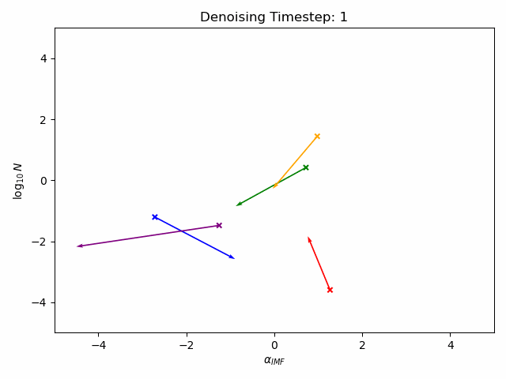

# Bayesian Model Comparison with Simulation-Based Inference

This repo explores a novel approach to Simulation-Based Inference (SBI) and Bayesian Model Comparisan by leveraging a [**score-based diffusion model**](https://arxiv.org/abs/2011.13456) combined with a [**transformer architecture**](https://arxiv.org/abs/1706.03762) [[Peebles et al.](https://arxiv.org/abs/2212.09748), [Gloecker et al.](https://arxiv.org/abs/2404.09636)].  
The model utilizes an **attention mask** to conditionally predict both the **posterior distribution** and the **likelihood** of the data.  
By employing the [**harmonic mean estimator**](https://academic.oup.com/rasti/article/2/1/710/7382245), we efficiently compute the **evidence** required for **Bayesian model comparison**.  

This framework is applied to compare different yield sets in a simulator for stellar abundances from galactic and stellar parameters ([**CHEMPY**](https://arxiv.org/pdf/1909.00812)), providing a robust and scalable method for likelihood-free inference in high-dimensional parameter spaces.

### Workflow

---
---
## Diffusion Model

### Perturbing Data in a Diffusion Process
For the training of the diffusion model we have to first turn our data into noise and then train the transformer to denoise it step by step for every timestep.  
The diffusion process is defined by the following equation:

$$
d\mathbf{x} = \mathbf{f}(\mathbf{x},t) dt + g(t) d\mathbf{w}
$$

where $\mathbf{f}(\cdot, t): \mathbb{R}^d \to \mathbb{R}^d$ is called the *drift coefficient* of the stochastic differential equation (SDE), $g(t) \in \mathbb{R}$ is called the *diffusion coefficient*, and $\mathbf{w}$ represents the standard Brownian motion.  
We use a Variance Exploding SDE (VESDE) for the diffusion process, where the *drift* and *diffusion coefficients* are defined as followed:

$$
\mathbf{f}(\mathbf{x}, t) = \mathbf{0} \quad \text{and} \quad g(t) = \sigma^t
$$

where $\sigma$ is a hyperparameter that controls the scale of the diffusion process.  
Following the theory of SDEs, we can formulate the perturbed data distribution at timestep $t$ as:

$$
    p_{0t}(\mathbf{x}_t|\mathbf{x}_0) = \mathcal{N} \bigg( \mathbf{x}_t | \mathbf{x}_0, \frac{1}{2 \ln \sigma}(\sigma^{2t}-1)\mathbf{I} \bigg)
$$

So the variance function over time of the perturbed data distribution is given by:

$$
    \sigma_t^2 = \frac{1}{2 \ln \sigma}(\sigma^{2t}-1)
$$

Step-by-step diffusion process with Variance Exploding SDE (VESDE):  

Galactic Parameters           |  Chemical Abundances
:-------------------------:|:-------------------------:
  |  

### Reversing the Diffusion Process
Reversing the diffusion process is running the diffusion process backwards in time. 

$$
d\mathbf{x} = \big[\mathbf{f}(\mathbf{x}, t) - g^2(t)\nabla_{\mathbf{x}}\log p_t(\mathbf{x}) \big] dt + g(t) d\bar{\mathbf{w}}
$$

where $\bar{\mathbf{w}}$ is a Brownian motion in the reverse time direction, and $dt$ represents an infinitesimal negative time step. This reverse SDE can be computed once we know the drift and diffusion coefficients of the forward SDE, as well as the score of $p_t(\mathbf{x})$ for each $t\in[0, T]$.  

In the case of the VESDE, the drift and diffusion coefficients are given by:

$$
\mathbf{f}(\mathbf{x}, t) = \mathbf{0} \quad \text{and} \quad g(t) = \sigma^t
$$

where $\sigma$ is a hyperparameter that controls the scale of the diffusion process.    
The remaining unknown would then only be the score-function $\nabla_\mathbf{x} \log p_t(\mathbf{x})$ to numerically obtain samples $p_0$ from the prior distribution $p_T$.  
That can be done by approximating the score function with a neural network.

$$
s_{\theta}(\mathbf{x},t) \approx \nabla_\mathbf{x} \log p_t(\mathbf{x})
$$

In this case, we use a transformer architecture to approximate the score function.  

### Time-Dependendent Score-Predicting Condition Transformer

In theory there are no limitations on the model used to approximate the score function. However, as proposed in the [All-in-one Simualtion Based Inference](https://arxiv.org/abs/2404.09636) paper, we use a transformer architecture as they  overcome limitations of feed-forward networks in effectively dealing with sequential inputs.  
In order to control the attention of the transformer to just conditional tokens, we use an attention mask to prevent latent tokens from attending to other latent tokens, that hold no information, as they are drawn from the initial noise distribution.  
For that we use the diffusion transformer with adaptive layer normalization initialized at Zero (DiT with adaLN-Zero) as proposed in the [DiT paper](https://arxiv.org/abs/2212.09748).  
Our model is modified to deal with continuos data and uses the timestep in the diffusion process as conditional information.  
The attention mask in the Multi-Head Self Attention Layer controls the attention from latent tokens to just the observed tokens.  

By providing the transformer with the joint $(\theta, \mathbf{x})$ as input, it is possible to use the model as NPE and NLE.  

The data is embedded by projecting it into a high-dimensional space using an embedding layer.  
The timestep is embedded using a Gaussian Fourier Embedding.
The condition mask $\mathcal{M}_C$ is a binary mask that indicates which values are observed and which are latent.  
A condition value of $\mathcal{M}_C ^{(i)} = 0$ corresponds to a latent value, that needs to be inferred and a condition value of $\mathcal{M}_C ^{(i)} = 1$ corresponds to an observed value, which the model can use to infer the latent values.  

### Training

We can train a time-dependent score-based model $s_{\theta}(\mathbf{x},t)$ to approximate the score function $\nabla_{\mathbf{x}}\log p_t(\mathbf{x})$ to obtain samples from $p_0$ using samples from a prior distribution $p_T$.  
During the training process our goal is to minimize the following weighted sum of denoising score matching objectives: 

$$
    \min_ \theta \mathbb{E}_ {t} \bigg[\lambda(t) \mathbb{E}_ {\mathbf{x}_ 0} \mathbb{E}_ {\mathbf{x}_ t}\big[ \Vert s_ \theta(\mathbf{x}_ t,t) - \nabla_ {\mathbf{x}}\log p_ {t}(\mathbf{x}) \Vert _ 2^2 \big]\bigg]
$$

The expectation over $\mathbf{x}_ 0$ can be estimated by samples from our original data distribution $p_ 0$.  
The expectation over $\mathbf{x}_ t$ can be estimated by samples from the pertubated data distribution $p_ {0t}$.  
And $\lambda(t)$ is the weighting function that can be used to assign different importance to different timesteps. In the case of our VESDE we set it to $\lambda(t) = \sigma_t^2$.  
 
The training process follows these steps:

1. Pick a datapoint $\mathbf{x}_0$

2. Sample $\mathbf{x}_1 \sim \mathcal{N}(\mathbf{x}|0,\mathbf{I})$

3. Sample $t \sim \text{Uniform}(0,1)$

4. Calculate $\mathbf{x}_ t = \mathbf{x}_ 0 + \sqrt{\frac{1}{2 \ln \sigma}(\sigma^{2t}-1)} \cdot \mathbf{x}_ 1$. This is a sample from $p_ {0t}(\mathbf{x}_ t|\mathbf{x}_ 0)$

5. Evaluate the score model at $\mathbf{x}_ t$ and $t$, $s_ {\theta}(\mathbf{x}_ t,t)$

6. Calculate the score matching loss for a single sample: $\mathcal{L}_ t(\theta) = \sigma_ t^2 \Vert \mathbf{x}_ 1-\sigma_ t s_ {\theta}(\mathbf{x}_ t,t) \Vert ^2$

7. Update $\theta$ using gradient-based method with $\nabla_ {\theta}\mathcal{L}(\theta)$

### Sampling
#### Euler-Maruyama
To solve the reverse SDE we can use the Euler-Maruyama method.  
The Euler-Maruyama method is a simple first-order solver that approximates the solution of an SDE by discretizing the time interval into small steps and is a widely used method to solve SDEs.

$$
\mathbf{x}_ {t+1} = \mathbf{x}_ t + \mathbf{f}(\mathbf{x}_ t,t) \Delta t + g(t) \Delta \mathbf{w}
$$

where 

$$
\Delta \mathbf{w} = \mathbf{w}_ {t+1} - \mathbf{w}_ t = s_ {\theta}(\mathbf{x}_ t,t)
$$

We can then rewrite the denoising step at time $t$ as:

$$
\mathbf{x}_ {t-1} = \mathbf{x}_ t - \frac12 \sigma^{2t} s_ {\theta}(\mathbf{x}_ t,t)dt
$$

Basically we take a sample $x_T$ from the prior distribution $p_ T$ and give it to the transformer to get the score $s_ {\theta}(\mathbf{x}_ T,T)$.  
With that we can calculate the noise that needs to be subtracted from the sample $x_T$, which returns a slightly denoised sample.  
These steps can be repeated to get a fully denoised sample $x_0$ at $t=0$.  

Distribution Denoising | Single Sample Denoising
:-------------------------:|:-------------------------:
 | 

#### DPM-Solver
The [DPM-Solver](https://arxiv.org/pdf/2206.00927) is a more sophisticated numerical method for solving the reverse SDE compared to Euler-Maruyama, by offering higher-order numerical integration for more accurate and efficient sampling.

DPM-Solver works by approximating the reverse diffusion process using a deterministic ODE solver with the following key advantages:
- **Higher-order integration**: Supports 1st, 2nd, and 3rd order methods for increased accuracy
- **Faster convergence**: Typically requires fewer discretization steps than Euler-Maruyama
- **Improved sample quality**: Produces cleaner, more accurate samples given the same number of steps

The method can be implemented with different orders of accuracy:

**First-order**:
$$
\mathbf{x}_{t-1} = \mathbf{x}_t - (t-t') \sigma_t s_{\theta}(\mathbf{x}_t, t)
$$

**Second-order**:
$$
\begin{align*}
\mathbf{x}_{t'} &= \mathbf{x}_t - (t-t') \sigma_t s_{\theta}(\mathbf{x}_t, t) \\
\mathbf{x}_{t-1} &= \mathbf{x}_t - \frac{1}{2}(t-t') (\sigma_t^2 s_{\theta}(\mathbf{x}_t, t) + \sigma_{t'}^2 s_{\theta}(\mathbf{x}_{t'}, t'))
\end{align*}
$$

**Third-order**:
Extends the approximation with additional intermediate points for even greater accuracy.

Our implementation further enhances DPM-Solver with periodic **Langevin corrector steps**, which refines the solution using controlled stochasticity. The corrector applies several steps of Langevin dynamics:

$$
\mathbf{x} = \mathbf{x} + \text{snr} \cdot \sigma_t^2 \cdot s_{\theta}(\mathbf{x}, t) + \sqrt{\text{snr} \cdot 2 \cdot \sigma_t^2} \cdot \mathbf{z}
$$

where $\mathbf{z} \sim \mathcal{N}(0, \mathbf{I})$ and $\text{snr}$ is the signal-to-noise ratio that controls the step size.

The combination of high-order DPM-Solver steps with periodic Langevin correction allows for:
1. Fast, accurate evolution of the diffusion process (predictor)
2. Stochastic refinement that helps explore the probability space (corrector)

This hybrid approach produces high-quality samples with fewer function evaluations than the basic Euler-Maruyama method, especially when sampling complex distributions.

Distribution Denoising | Single Sample Denoising
:-------------------------:|:-------------------------:
 | 

---
---
## Bayesian Model Comparison

We have different models $\mathcal{M}$, that can describe our system (different yield sets). Our goal is to infere which model $\mathcal{M}$ is best suited to describe the observations $x$.  
We use Bayes' theorem to compare the models.

$$ \begin{align*}
P(\theta|x;\mathcal{M}) &= \frac{P(x|\theta;\mathcal{M})P(\theta|\mathcal{M})}{P(x|\mathcal{M})} = \frac{\mathcal{L}(\theta) \cdot \pi(\theta)}{z} \\ \\
\text{Posterior} &= \frac{\text{Likelihood} \times \text{Prior}}{\text{Evidence}}
\end{align*} $$

A crucial part of the model comparison is the computation of the evidence or marginal likelihood $z$. The evidence is the probability of  observing the data over all parameters $\theta$ and can be computed by marginalizing the likelihood over the prior.  

$$
P(\text{data}) = \int P(\text{data}|\theta)P(\theta) d\theta
$$

### Learned Harmonic Mean Estimator
Unfortunately in a high-dimensional parameter space, the evidence is computationally intractable.  
The learned harmonic mean estimator gives us a method to estimate the evidence for that case with the use of importance sampling.   

We utilize the fact that the harmonic mean of the likelihoods is the reciprocal of the evidence.  
The harmonic mean estimator is given by [[Newton & Raftery 1994](https://www.jstor.org/stable/2346025)]:

$$ \begin{align*}
\rho &= \mathbb{E}_ {P(\theta|x)} [\frac1{\mathcal{L}(\theta)}] \\
 &= \int d\theta \frac1{\mathcal{L}(\theta)}P(\theta|x) \\
 &= \int d\theta \frac1{\mathcal{L}(\theta)}\frac{\mathcal{L}(\theta) \pi(\theta)}{z} \\
 &= \frac1z \\
=> \hat\rho &=\frac1N \sum_{i=1}^{N} \frac1{\mathcal{L}(\theta)}
\end{align*} $$

If we treat this as an importance sampling problem, we can elimate the problem of an exploding variance.  
Therefore we introduce a new target distribution $\phi(\theta)$.  
The harmonic mean estimator can then be re-written as [[Mancini et al. 2023](https://academic.oup.com/rasti/article/2/1/710/7382245#supplementary-data)]:

$$
\rho = z^{-1} = \frac1N \sum_ {i=1}^{N} \frac{\phi(\theta_ i)}{\mathcal{L}(\theta_ i)\pi(\theta_ i)}, \quad \text{where } \theta_ i \sim p(\theta|\text{data})
$$

Where we sample from the posterior distribution and calculate the likelihood of the sample. 
The ideal target distribution $\phi(\theta)$ is the posterior distribution $p(\theta|\text{data})$ which we can learn using SBI, like described in the previous section. 
 

> **_NOTE:_** The paper states, that the target distribution $\phi(\theta)$ should not be the learned NPE, but instead be a different model, that however approximates the posterior aswell.  
 Honestly I'm not really sure yet what this means!  

Now the benefit of using a diffusion model for SBI comes into play. 
The diffusion model from the previous section can be used to estimate the likelihood $\mathcal{L}(\theta)$
 and the posterior $\phi(\theta)$ of our system, 
 meaning it is just needed to train one model to estimate the evidence $z$.  

### Evidence Calculation

1. Take observation sample $x_i$

2. Sample posterior $\theta_{i;j} \sim P_j(\theta|x_i)$ using the diffusion model for each model $\mathcal{M_j}$

3. Evaluate likelihood at sample position $\mathcal{L}_ j (\theta_ {i;j})$ also using the diffusion model

$=>$  Compute evidence $z$ by repeating $1.-3.$ $N$-times and then using the harmonic mean estimator $\hat \rho = \frac1N \sum_{i=1}^{N} \frac{\phi(\theta_i)}{\mathcal{L}(\theta_i)\pi(\theta_i)}$

### Model Comparison
To predict the best fitting model, we use Bayes update rule to calculate the posterior probability of each model.  

$$ \begin{align*}
P(\mathcal{M}_ j|x) &= \frac{P(x|\mathcal{M}_ j) P(\mathcal{M}_ j)}{P(x)} \\\\
&= \frac{\mathcal{L}_ j(\theta_ {i;j}) \cdot \pi(\mathcal{M}_ j)}{z}
\end{align*} $$

We start with a uniform prior over the models. By evaluating multiple observations, the posterior probability of each model can be updated.  
The model with the highest posterior probability is the best fitting model.  
